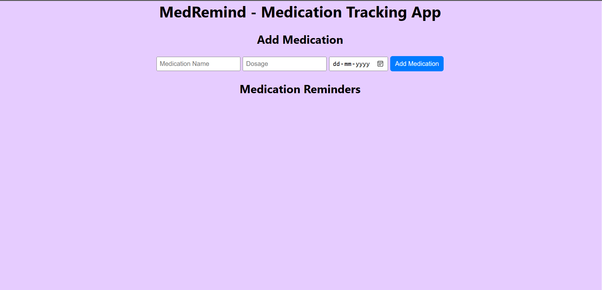

MedRemind - Medication Tracking App
MedRemind is a simple medication tracking app built using React.js. It helps you keep track of your medications, set reminders, and mark medications as taken. Never miss a dose again!

Features
Add medications with details such as medication name, dosage, and schedule.
Display medication reminders for the day.
Mark medications as taken to keep track of adherence.
User-friendly interface for easy interaction.
Installation
Clone the repository:

bash
Copy code
git clone https://github.com/Ganesh651/kratin_assignment_medremind_app.git
Navigate to the project directory:

bash
Copy code
cd med-remind
Install the required dependencies:

bash
Copy code
npm install
Start the development server:

bash
Copy code
npm start
Open your browser and go to http://localhost:3000 to use the app.

Usage
Add Medication: Enter the medication name, dosage, and schedule using the provided input fields. Click the "Add Medication" button to add the medication to your list.

Display Reminders: The app displays medication reminders for the day. Medications are listed with their name, dosage, and schedule.

Mark Medication as Taken: To mark a medication as taken, click the "Mark as Taken" button next to the respective medication. The medication will be marked as taken, and you'll receive feedback.

Contributing
Contributions are welcome! If you'd like to contribute to MedRemind, please follow these steps:

Fork the repository.

Create a new branch for your feature/bug fix:

bash
Copy code
git checkout -b feature/new-feature
Make your changes and commit them:

bash
Copy code
git commit -m "Add new feature"
Push to your forked repository:

bash
Copy code
git push origin feature/new-feature
Create a pull request on the original repository.

Acknowledgements
Built using React.js and styled with CSS.
Thanks to Kratin for giving this oppurtunity.
